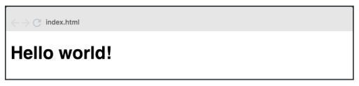

# Trabajo Práctico de React
## Ejercicio 1 - Hello World

Crear una aplicación web con un componente que muestre en pantalla el mensaje
“Hello World”.

## Repositorio GitHub

## Deploy

## Autor

**Mendoza, Mariana Eugenia** 😃

## Herramientas Utilizadas 🛠️

- HTML
- CSS 
- Bootstrap 5.3.3
- JavaScript
- GIT y GitHub
- React
